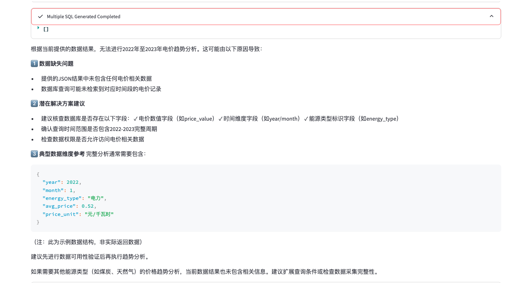

## 关于模型管理中接入DeepSeek

### 接入 Bedrock DeepSeek R1

GenBI 方案目前不支持直接接入 BedRock DeepSeek R1，所以首先部署[ BR Connector](https://github.com/aws-samples/sample-connector-for-bedrock)

然后在 GenBI 管理界面新建 brclient 类型 API。

API URL：BR Connector 方案的 URL

```json
API URL：https://d3jg8xxxxxx.cloudfront.net/v1/chat/completions
```

API Header

```json
{"Content-Type": "application/json","Authorization": "Bearer br-xxxxxxxxxx"}
```


Mode Input Payload：

```json
{"model": "deepseek-r1", "messages": [{"role": "system", "content": "SYSTEM_PROMPT"}, {"role": "user", "content": "USER_PROMPT"}], "temperature": 0,"max_tokens": 32768}
```


Model Output Format


```json
response.get('choices')[0].get('message').get('content')
```

配置示例如下：


### 配置硅基流动的 DeepSeek API

API URL

```json
API URL：https://api.siliconflow.cn/v1/chat/completions
```

API Header

```json
{"Content-Type": "application/json","Authorization": "Bearer sk-ead82xxxxxxxxx"}
```


Mode Input Payload：

如果是用deepseek V3模型，model更换成：Pro/deepseek-ai/DeepSeek-V3 即可


```json
{"model":"Pro/deepseek-ai/DeepSeek-R1","temperature":0.01,"messages":[{"content":"SYSTEM_PROMPT","role":"system"},{"content":"USER_PROMPT","role":"user"}]}
```


Model Output Format


```json
response.get('choices')[0].get('message').get('content')
```


配置示例如下：


## 关于数据库的接入

### 接入 PostgreSQL

1. PG 数据库名字为public 是系统默认的 schema，GenBI方案不能接入这个 schema，需要将数据表创建在自己创建的 schema 下面。


## Knowledge Search意图无法从Entity召回

1. v1.9代码中对于knowledge\_search的逻辑并没有实现从Entity中召回，运用以下两个补丁。

修改state_machine.py的patch
```python
--- a/application/nlq/core/state_machine.py	2025-02-21 09:11:33.000000000 +0000
+++ b/application/nlq/core/state_machine.py	2025-04-09 16:37:15.193979226 +0000
@@ -195,9 +195,18 @@
                 each_item_dict["_source"] = each_entity["_source"]
                 if "vector_field" in each_item_dict["_source"]:
                     del each_item_dict["_source"]["vector_field"]
-                entity_retrieve.append(each_item_dict)
+                if each_entity['_score'] > 0.8:
+                    entity_retrieve.append(each_item_dict)
                 if each_entity['_source']['entity_count'] > 1 and each_entity['_score'] > 0.98:
                     same_name_entity[each_entity['_source']['entity']] = each_entity['_source']['entity_table_info']
+            # 保存实体信息到answer对象中
+            self.answer.ask_entity_select.entity_retrieval = entity_retrieve
+        
+            # 如果是knowledge_search意图，直接转向KNOWLEDGE_SEARCH状态
+            if self.answer.query_intent == "knowledge_search":
+                self.transition(QueryState.KNOWLEDGE_SEARCH)
+                return
+                               
             if len(same_name_entity) > 0 and self.answer.query_intent == "normal_search":
                 for key, value in same_name_entity.items():
                     change_value = []
@@ -378,7 +387,10 @@
             self.answer.query_intent = "reject_search"
             self.transition(QueryState.REJECT_INTENT)
         elif self.knowledge_search_flag:
-            self.transition(QueryState.KNOWLEDGE_SEARCH)
+            #self.transition(QueryState.KNOWLEDGE_SEARCH)
+            self.answer.query_intent = "knowledge_search"
+            # 先进入实体检索状态
+            self.transition(QueryState.ENTITY_RETRIEVAL)
         elif self.agent_intent_flag:
             self.answer.query_intent = "agent_search"
             self.transition(QueryState.AGENT_TASK)
@@ -395,10 +407,14 @@
 
     @log_execution
     def handle_knowledge_search(self):
+        # 使用已经保存在 answer 对象中的实体信息
+        entity_info = self.answer.ask_entity_select.entity_retrieval
         response, model_response = knowledge_search(search_box=self.context.query_rewrite,
                                                     model_id=self.context.model_type,
                                                     prompt_map=self.context.database_profile["prompt_map"],
-                                                    environment_dict=self.context.database_profile["prompt_environment"])
+                                                    environment_dict=self.context.database_profile["prompt_environment"],
+                                                    entity_info=entity_info  # 添加实体信息参数
+                                                    )
         self.token_info[QueryState.KNOWLEDGE_SEARCH.name] = model_response.token_info
         self.answer.query = self.context.search_box
         self.answer.query_rewrite = self.context.query_rewrite

```

修改llm.py的patch

```python
--- a/application/utils/llm.py	2025-02-21 09:11:33.000000000 +0000
+++ b/application/utils/llm.py	2025-04-09 16:53:04.918121926 +0000
@@ -388,7 +388,28 @@
     return query_rewrite_result, model_response
 
 
-def knowledge_search(model_id, search_box, prompt_map, environment_dict=None):
+def knowledge_search(model_id, search_box, prompt_map, environment_dict=None, entity_info=None):
+    # 创建环境字典的副本，以便我们可以添加实体信息
+    if environment_dict is None:
+        environment_dict = {}
+    else:
+        environment_dict = environment_dict.copy()
+    
+    # 如果有实体信息，构建实体信息字符串
+    entity_info_str = ""
+    if entity_info and len(entity_info) > 0:
+        entity_info_str = "\n\n相关实体信息：\n"
+        for entity in entity_info:
+            entity_source = entity.get("_source", {})
+            entity_name = entity_source.get("entity", "")
+            entity_comment = entity_source.get("comment", "")
+            entity_type = entity_source.get("entity_type", "")
+            entity_info_str += f"- 实体名称: {entity_name}, 类型: {entity_type}, 描述: {entity_comment}\n"
+    
+    # 将实体信息添加到环境字典中
+    environment_dict["entity_info"] = entity_info_str
+    
+    # 生成提示并调用模型
     user_prompt, system_prompt = generate_knowledge_prompt(prompt_map, search_box, model_id, environment_dict)
     max_tokens = 2048
     model_response = invoke_llm_model(model_id, system_prompt, user_prompt, max_tokens, False)

```

* 修改提示词

**Intent Prompt：**

**修改System Prompt 中的示例，增加knowledge\_search 意图的slot**

```python
You are an intent classifier and entity extractor, and you need to perform intent classification and entity extraction on search queries.
Background: I want to query data in the database, and you need to help me determine the user's relevant intent and extract the keywords from the query statement. Finally, return a JSON structure.

There are 4 main intents:
<intent>
- normal_search: Query relevant data from the data table
- reject_search: Delete data from the table, add data to the table, modify data in the table, display usernames and passwords in the table, and other topics unrelated to data query，还包括闲聊
- agent_search: Attribution-based problems are not about directly querying the data. Instead, they involve questions like "why" or "how" to understand the underlying reasons and dynamics behind the data.
- knowledge_search: Questions unrelated to data, such as general knowledge, such as meaning for abbviations, terminology explanation, etc.

</intent>

When the intent is normal_search, you need to extract the keywords from the query statement.

Here are some examples:

<example>
question : 希尔顿在欧洲上线了多少酒店数
answer :
{
    "intent" : "normal_search",
    "slot" : ["希尔顿", "欧洲", "上线", "酒店数"]
}

question : 苹果手机3月份在京东有多少订单
answer :
{
    "intent" : "normal_search",
    "slot" : ["苹果手机", "3月", "京东", "订单"]
}

question : 修改订单表中的第一行数据
answer :
{
    "intent" : "reject_search"
}

question : 6月份酒店的订单为什么下降了
answer :
{
    "intent" : "agent_search"
}

question : 什么是同比？
answer :
{
    "intent" : "knowledge_search",
    "slot" : ["同比"]
}
</example>

Please perform intent recognition and entity extraction. Return only the JSON structure, without any other annotations.

```


**Knowledge Prompt：**

**修改System Prompt：**

```python
You are a knowledge QA assistant. Your goal is to provide accurate and concise answers based on the given information. Follow these rules:

Keep answers brief and to the point
Only answer based on provided knowledge
Say "I don't know" if you're unsure
Don't make assumptions or add external information
Maintain a professional and helpful tone
```


**修改User Prompt**

```pyhton
Question: {question}

Reference knowledge:
<knowledge>
{entity_info}
</knowledge>

Please provide a concise answer based only on the reference knowledge above.
```


## 关于提示词优化

1. 如果用户问了一个模糊的问题，希望大模型返回询问用户补充的信息，在Prompt Management 中， Prompt Type 为Query Rewrite-系统提示词的ask\_in\_reply，添加需要返回询问的提示词，示例如下：


效果如下：


## Agent Search 流程出现错误

### SQL查询结果字符串格式匹配错误

错误截图：


错误信息：
```python
{"AGENT\_DATA\_SUMMARY":"1 validation error for TaskSQLSearchResult\nsub\_task\_query\n  Input should be a valid string \[type=string\_type, input\_value=\[{'step': 1, 'goal': '获...季节性波动规律'}], input\_type=list]\n    For further information visit https://errors.pydantic.dev/2.11/v/string\_type"}
```

这个错误明确指出了问题所在：TaskSQLSearchResult类的sub\_task\_query字段需要一个字符串类型的值，但实际传入的是一个列表类型的值

\[{'step': 1, 'goal': '获...季节性波动规律'}]。


解决办法：

我们创建的patch文件正是针对这个问题的修复：

1. 它检测query\_value是否为列表类型

2. 如果是列表，将其转换为JSON字符串

3. 如果转换失败，则回退到简单的字符串转换

4. 使用转换后的字符串值作为sub\_task\_query参数


### 没有返回SQL执行结果的错



有几种错误情况：

1. SQL语法错误：   (pymysql.err.ProgrammingError) (1064, "You have an error in your SQL syntax; check the manual that corresponds to your MySQL server version for the right syntax to use near 'SELECT YEAR(

date) AS year, MONTH(date) AS month, ROUND(AVG(average\_price),' at line 8")  这表明生成的SQL语句在第8行附近有语法错误，可能是多个SELECT语句没有正确分隔或子查询没有正确括起来。

2\. JSON解析错误：   Expecting value: line 1 column 1 (char 0)  由于SQL执行失败，返回了空数据，导致后续的JSON解析失败。

3\. 数据分析失败：   The data related to the question is：\[]  由于前面的错误，导致数据分析阶段收到了空数据。

解决办法：

1. 在 handle\_agent\_analyze\_data函数添加SQL自动纠错逻辑：

```python
   @log_execution
    def handle_agent_analyze_data(self):
        # Analyze the data
        try:
            filter_deep_dive_sql_result = []
            agent_sql_search_result = []
            for i in range(len(self.agent_search_result)):
                each_task_res = get_sql_result_tool(
                    self.context.database_profile,
                    self.agent_search_result[i]["sql"])
                # 添加SQL自动纠错逻辑
                if each_task_res["status_code"] == 500 and self.context.auto_correction_flag:
                    logger.info(f"Attempting to correct SQL for agent task {i+1}")
                    # 保存原始SQL和错误信息
                    original_sql = self.agent_search_result[i]["sql"]
                    error_info = each_task_res["error_info"]
                    
                    # 重新生成SQL
                    corrected_sql, corrected_response = self._generate_agent_sql_again(
                        self.agent_search_result[i]["query"], 
                        original_sql, 
                        error_info
                    )
                    
                    if corrected_sql and corrected_sql != "":
                        # 使用修复后的SQL重新执行
                        logger.info(f"Retrying with corrected SQL: {corrected_sql}")
                        self.agent_search_result[i]["sql"] = corrected_sql
                        self.agent_search_result[i]["response"] = corrected_response
                        each_task_res = get_sql_result_tool(
                            self.context.database_profile,
                            corrected_sql
                        )
                if each_task_res["status_code"] == 200 and len(each_task_res["data"]) > 0:
                    self.agent_search_result[i]["data_result"] = each_task_res["data"].to_json(
                        orient='records')
                    filter_deep_dive_sql_result.append(self.agent_search_result[i])

                    show_select_data = [list(each_task_res["data"].columns)] + each_task_res["data"].values.tolist()
                    each_task_sql_response = get_generated_sql_explain(self.agent_search_result[i]["response"])
                    sub_task_sql_result = SQLSearchResult(sql_data=show_select_data,
                                                          sql=self.agent_search_result[i]["sql"],
                                                          data_show_type="table",
                                                          sql_gen_process=each_task_sql_response,
                                                          data_analyse="", sql_data_chart=[])
                    query_value = self.agent_search_result[i]["query"]
                    if isinstance(query_value, list):
                        try:
                            logger.info(f"Converting list to string for sub_task_query: {query_value}")
                            query_value = json.dumps(query_value)  # 将列表转换为JSON字符串
                        except Exception as e:
                            logger.error(f"Error converting list to JSON string: {e}")
                            query_value = str(query_value)  # 回退到简单的字符串转换
                    each_task_sql_search_result = TaskSQLSearchResult(
                        sub_task_query=query_value,
                        sql_search_result=sub_task_sql_result)
                    agent_sql_search_result.append(each_task_sql_search_result)

            # 如果没有成功执行的SQL，添加详细的错误信息但继续流程
            if len(filter_deep_dive_sql_result) == 0:
                error_details = []
                for i in range(len(self.agent_search_result)):
                    task_info = {
                        "query": self.agent_search_result[i]["query"],
                        "sql": self.agent_search_result[i]["sql"]
                    }
                    
                    # 获取错误信息（如果有）
                    task_res = get_sql_result_tool(
                        self.context.database_profile,
                        self.agent_search_result[i]["sql"])
                    if task_res["status_code"] == 500:
                        task_info["error"] = task_res["error_info"]
                    else:
                        task_info["error"] = "Unknown error or no data returned"
                        
                    error_details.append(task_info)
                
                # 记录详细的错误信息
                self.answer.error_log[QueryState.AGENT_DATA_SUMMARY.name] = {
                    "message": "All agent tasks failed to execute SQL successfully.",
                    "details": error_details
                }
                
                # 添加一个标志表示有SQL执行错误
                self.has_sql_errors = True
                
                # 创建一个特殊的错误消息
                self.agent_data_analyse_result = "No data was found for your query. This could be because the SQL queries failed to execute properly or because there is no matching data in the database."
                self.agent_valid_data = []

            # 只有当有成功执行的SQL结果时，才调用data_analyse_tool
            if len(filter_deep_dive_sql_result) > 0:
                agent_data_analyse_result, model_response = data_analyse_tool(self.context.model_type,
                                                                              self.context.database_profile["prompt_map"],
                                                                              self.context.query_rewrite,
                                                                              json.dumps(filter_deep_dive_sql_result,
                                                                                         ensure_ascii=False), "agent",
                                                                              self.context.database_profile["prompt_environment"])
                self.token_info[QueryState.AGENT_DATA_SUMMARY.name] = model_response.token_info
            else:
                # 使用之前设置的错误消息
                agent_data_analyse_result = self.agent_data_analyse_result if hasattr(self, 'agent_data_analyse_result') else "No data available for analysis."
                # 为空结果设置一个空的token_info
                if QueryState.AGENT_DATA_SUMMARY.name not in self.token_info:
                    self.token_info[QueryState.AGENT_DATA_SUMMARY.name] = {"input_tokens": 0, "output_tokens": 0}

            self.agent_valid_data = filter_deep_dive_sql_result
            self.agent_data_analyse_result = agent_data_analyse_result
            self.answer.agent_search_result.agent_summary = agent_data_analyse_result
            self.answer.agent_search_result.agent_sql_search_result = agent_sql_search_result
            self.transition(QueryState.COMPLETE)
        except Exception as e:
            self.answer.error_log[QueryState.AGENT_DATA_SUMMARY.name] = str(e)
            logger.error(
                f"The context is {self.context.search_box}, handle_agent_analyze_data encountered an error: {e}")
            self.transition(QueryState.ERROR)
```

* 新写一个函数\_generate\_agent\_sql\_again，重新生成agent任务的SQL，使用错误信息作为额外上下文

```python
 def _generate_agent_sql_again(self, task_query, original_sql, error_info):
    #重新生成agent任务的SQL，使用错误信息作为额外上下文
        try:
            # 构建包含错误信息的提示
            additional_info = f'''\n NOTE: when I try to write a SQL <sql>{original_sql}</sql>, I got an error <e>{error_info}</e>. Please consider and avoid this problem. '''
            
            # 调用LLM重新生成SQL
            response, model_response = text_to_sql(
                self.context.database_profile['tables_info'],
                self.context.database_profile['hints'],
                self.context.database_profile['prompt_map'],
                task_query,  # 使用子任务的查询而不是原始查询
                model_id=self.context.model_type,
                sql_examples=self.normal_search_qa_retrival if hasattr(self, 'normal_search_qa_retrival') else [],
                ner_example=self.normal_search_entity_slot if hasattr(self, 'normal_search_entity_slot') else [],
                dialect=self.context.database_profile['db_type'],
                model_provider=None,
                additional_info=additional_info
            )
            
            # 记录token使用情况
            if model_response.token_info is not None and len(model_response.token_info) > 0:
                if QueryState.SQL_GENERATION.name + "AGENT_CORRECTION" not in self.token_info:
                    self.token_info[QueryState.SQL_GENERATION.name + "AGENT_CORRECTION"] = {
                        "input_tokens": 0,
                        "output_tokens": 0
                    }
                
                if "input_tokens" in model_response.token_info:
                    self.token_info[QueryState.SQL_GENERATION.name + "AGENT_CORRECTION"]["input_tokens"] += model_response.token_info["input_tokens"]
                
                if "output_tokens" in model_response.token_info:
                    self.token_info[QueryState.SQL_GENERATION.name + "AGENT_CORRECTION"]["output_tokens"] += model_response.token_info["output_tokens"]
            
            # 提取SQL
            sql = get_generated_sql(response)
            
            # 应用行级安全策略
            post_sql = self._apply_row_level_security_for_sql(sql)
            
            return post_sql, response
        except Exception as e:
            logger.error(f"Error in _generate_agent_sql_again: {e}")
            return "", ""
```

修改的代码已经在原来fork的代码上，建立新的分支：https://github.com/comdaze/generative-bi-using-rag/tree/1.9.1

